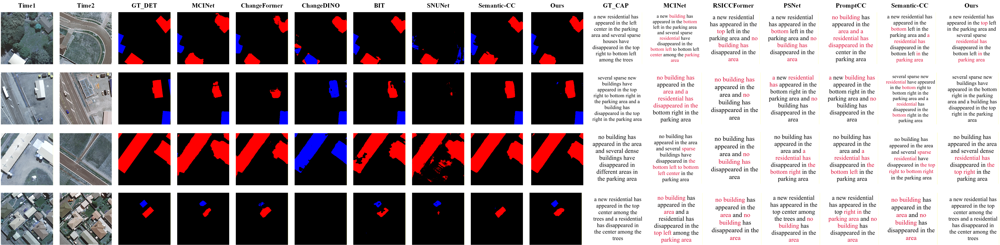
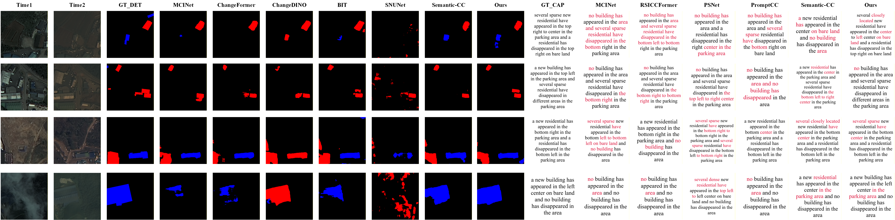
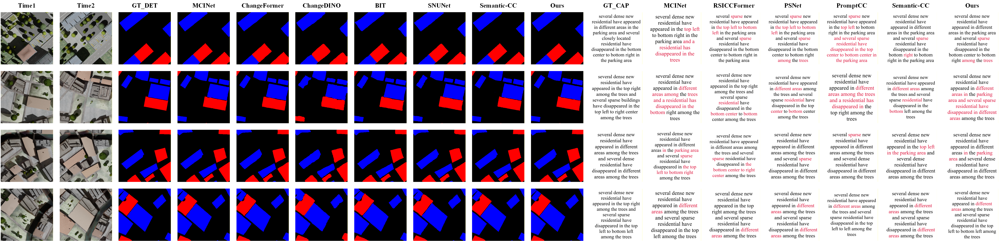
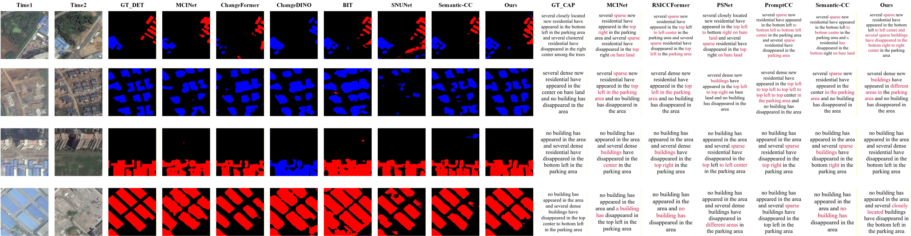
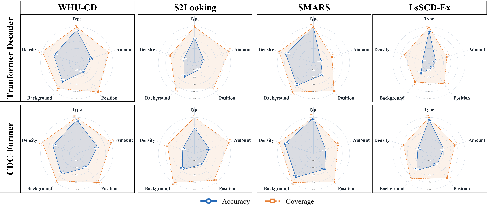
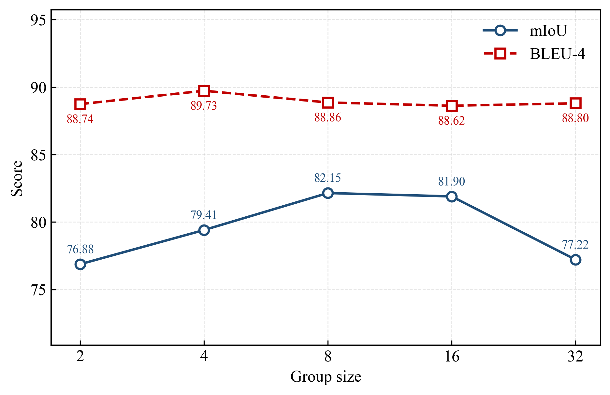
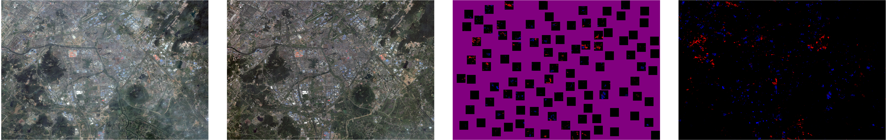
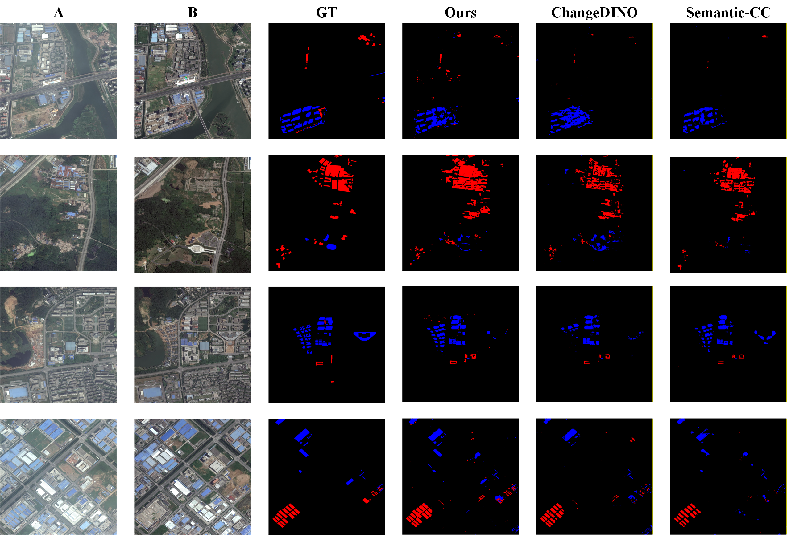
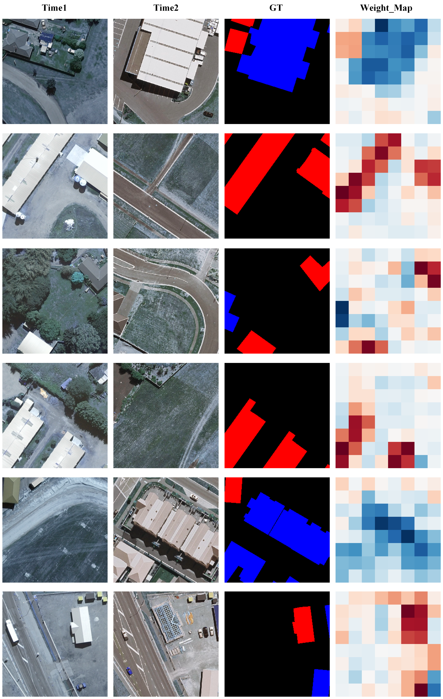

# ChangeBuilding

**ChangeBuilding: Dynamic Multi-Task Learning for Building Semantic Change Detection and Captioning in Remote Sensing Images**

Hu Yang, Wenqing Feng, Wei Xu, Yeqiang Gao, Fuping Liao
School of Computer and Software, Hangzhou Dianzi University, Hangzhou 310018, China

---

> [!WARNING]
> **This repository is NOT a complete implementation.**
>
> The code currently hosted here is a **partial release** prepared alongside manuscript submission. It is provided
> for reviewing purposes only and **does not yet support end-to-end reproduction** of the results reported in the
> paper: several preprocessing scripts, training configurations and evaluation utilities are still being cleaned
> up, and some third-party dependencies (DINOv3 weights, OPT-2.7B checkpoints) must be obtained separately.
>
> **A complete, fully documented and reproducible version — including all training/evaluation scripts,
> pretrained weights and the reconstructed BSCDC datasets — will be released here once the paper is accepted.**

---

## 1. Overview

Remote sensing change detection (RSCD) and image change captioning (RSICC) are two complementary paradigms for
urban monitoring, targeting pixel-level localization and semantic interpretation respectively. Conventional RSCD
methods output only binary masks without semantic interpretation, while existing multi-task frameworks struggle to
disentangle heterogeneous states — building **construction vs. demolition** — due to the lack of explicit
directional supervision and dense spatial priors, and they suffer from severe gradient conflicts between dense
prediction and autoregressive generation.

**ChangeBuilding** unifies pixel-level building semantic change detection with natural-language description in a
single dynamic multi-task framework. It introduces a new task paradigm, **Building Semantic Change Detection and
Captioning (BSCDC)**, which simultaneously outputs

* the **semantic change type** (new construction vs. demolition) as a pixel-level map, and
* a **concise textual description** composed of five information dimensions — *type, amount, position, background
  and density* — merged into a single sentence.

<p align="center">
  
  <br><b>Fig. 1</b> — Overall architecture of ChangeBuilding. Bi-temporal images pass through weight-shared feature
  extraction; the detection stream is enhanced by STPE and decoded by an FCN head into a semantic change map
  (red: demolished, blue: newly built) under <i>L</i><sub>det</sub>; the caption stream, guided by the STPE weight map,
  learnable queries and a task instruction, is processed by the CDC-Former and fed into a frozen OPT-2.7B LLM to
  generate descriptions under <i>L</i><sub>cap</sub>.
</p>

### Main contributions

1. **Four reconstructed BSCDC datasets.** Based on four public building change detection datasets (WHU-CD,
   S2Looking, SMARS and LsSCD-Ex), we reconstruct four multi-task datasets in which every bi-temporal pair is
   annotated with *both* semantic change labels and textual descriptions.
2. **Multi-Task Gated Adapter (MTGA).** Dynamically decomposes shared visual features into task-specific streams
   via learned gating, isolating the optimization interference between detection and captioning.
3. **Single-Temporal Phase Enhancement (STPE).** Exploits *signed* raw differences and semantic cosine similarity
   to model temporal phase shifts, sharply discriminating construction from demolition.
4. **Change-Detection-Captioning Transformer (CDC-Former).** Uses the STPE difference map as explicit spatial
   attention weights so that the compressed visual tokens fed to the LLM encode both signed temporal differences
   and dense spatial priors.

---

## 2. Method

### 2.1 Training strategy

ChangeBuilding is optimized with a **single-stage, end-to-end** joint loss. The only offline warm-up is a short
two-stage projector pre-training that is executed *once* and never alternates between the CD and CC objectives —
in contrast to the task-alternating multi-stage schedules of MCINet and Semantic-CC.

<p align="center">
  
  <br><b>Fig. 2</b> — Comparison of training strategies. Top: the multi-stage schedule of MCINet; bottom: our
  single-stage strategy with MTGA.
</p>

### 2.2 Multi-Task Gated Adapter (MTGA)

<p align="center">
  
  <br><b>Fig. 3</b> — Flowchart of the MTGA module. A frozen DINOv3 extracts deep semantic features which are
  replicated four times and projected into multi-scale features by the Multi-Scale Adapter Module (MSAM); in
  parallel a lightweight MobileNetV2 stream extracts hierarchical features aggregated by an FPN. The two streams
  are concatenated, compressed by a DsBnRelu block, channel-wise partitioned into <i>d</i> groups, and routed by a
  Gate unit into detection-specific and captioning-specific streams via coefficients α<sub>i</sub> and β<sub>i</sub>.
</p>

### 2.3 Single-Temporal Phase Enhancement (STPE)

<p align="center">
  
  <br><b>Fig. 4</b> — The STPE module. Unlike magnitude-based difference extractors, STPE models temporal phase
  shifts by exploiting signed raw differences and semantic cosine similarity, yielding polarity-aware
  representations that sharply separate construction from demolition.
</p>

### 2.4 Change-Detection-Captioning Transformer (CDC-Former)

<p align="center">
  
  <br><b>Fig. 5</b> — The CDC-Former module. The difference-enhanced map produced by STPE is injected as explicit
  spatial attention priors, directing the learnable queries towards semantically salient change regions before
  projection into the text embedding space of the frozen OPT-2.7B LLM.
</p>

---

## 3. Datasets

> [!NOTE]
> **Download links are not yet public.** The four reconstructed BSCDC subsets (semantic change labels + five-attribute
> captions) will be hosted after acceptance. Please fill in the URLs below before release, or contact the authors
> for early access.

| Source | Official download | Reconstructed BSCDC subset |
| :--- | :--- | :--- |
| WHU-CD | <!-- TODO --> `https://...` | <!-- TODO --> `https://...` |
| S2Looking | <!-- TODO --> `https://...` | <!-- TODO --> `https://...` |
| SMARS | <!-- TODO --> `https://...` | <!-- TODO --> `https://...` |
| LsSCD-Ex | <!-- TODO --> `https://...` | <!-- TODO --> `https://...` |

```bash
# TODO: provide the one-line download + extraction script, e.g.
# bash scripts/download_data.sh
```

### 3.1 Preprocessing

All four sources are cropped into standardized **256 × 256** patches, each paired with a pixel-level semantic
change map and a rule-based caption:

* **WHU-CD** — two single-epoch raster building masks are binarized and differenced; split 5,947 / 743 / 744.
* **S2Looking** — the 1,024 × 1,024 pairs are ranked by change-instance count, the richest 25 % are kept and then
  cropped; split 14,000 / 2,000 / 4,000.
* **SMARS** — the two 5,600 × 5,600 scenes are cropped with a 50 %-overlap sliding window; split 2,469 / 352 / 707.
* **LsSCD-Ex** — the *building* class is isolated from the eight-category land-cover maps of both epochs and
  differenced; each 2,048 × 2,048 pair is cut into an 8 × 8 grid and split at the pair level (70 / 10 / 20 pairs),
  giving 4,480 / 640 / 1,280 patches.

### 3.2 Rule-based caption templates

Captions are generated deterministically from five attributes, so that the text is physically grounded in the
pixel-level labels and free of hallucination.

| Rule | Template |
| :--- | :--- |
| Change Type | building have **[appeared/disappeared]**. |
| Change Amount | **[a/several]** building(s) have [appeared/disappeared]. |
| Change Position | [a/several] building(s) have [appeared/disappeared] in the **[center/top/left/right/bottom/...]**. |
| Change Background | [a/several] building(s) have [appeared/disappeared] in the [center/top/left/...] **[along the roads/among the trees/...]**. |
| Change Density | several **[dense/sparse]** buildings have [appeared/disappeared] in the [center/top/left/...] [along the roads/among the trees/...]. |

### 3.3 Statistics of the reconstructed datasets

| Dataset | Split (train/val/test) | Pixels of Appear / Disappear | Instances of Appear / Disappear |
| :--- | :--- | :--- | :--- |
| WHU-CD | 5,947 / 743 / 744 | 18,150,493 / 1,513,888 | 4,442 / 556 |
| S2Looking | 14,000 / 2,000 / 4,000 | 11,273,282 / 32,499,058 | 9,795 / 18,740 |
| SMARS | 2,469 / 352 / 707 | 30,314,785 / 12,495,285 | 10,678 / 4,658 |
| LsSCD-Ex | 4,480 / 640 / 1,280 | 5,010,674 / 5,069,760 | 2,563 / 2,380 |

---

## 4. Main results

IoU<sub>1</sub> and IoU<sub>2</sub> denote the IoU of the *disappearance* and *appearance* classes. All metrics are
in percent (%) except CIDEr, which is dimensionless. **Bold** marks the best result in each column.

### 4.1 WHU-CD and S2Looking

| Method | mIoU | IoU<sub>1</sub> | IoU<sub>2</sub> | BLEU-4 | METEOR | ROUGE<sub>L</sub> | CIDEr | mIoU | IoU<sub>1</sub> | IoU<sub>2</sub> | BLEU-4 | METEOR | ROUGE<sub>L</sub> | CIDEr |
| :--- | ---: | ---: | ---: | ---: | ---: | ---: | ---: | ---: | ---: | ---: | ---: | ---: | ---: | ---: |
| | **WHU-CD** | | | | | | | **S2Looking** | | | | | | |
| SNUNet | 68.82 | 27.17 | 80.39 | – | – | – | – | 49.36 | 32.60 | 18.86 | – | – | – | – |
| ChangeFormer | 75.08 | 38.27 | 87.72 | – | – | – | – | 62.36 | 52.44 | 36.63 | – | – | – | – |
| BIT | 74.37 | 39.88 | 84.16 | – | – | – | – | 63.95 | 53.70 | 40.18 | – | – | – | – |
| ChangeDINO | 71.64 | 32.03 | 83.64 | – | – | – | – | 51.56 | 49.63 | 6.66 | – | – | – | – |
| PSNet | – | – | – | 84.84 | 59.09 | 92.13 | 778.81 | – | – | – | 70.36 | 48.91 | 83.84 | 572.08 |
| RSICCformer | – | – | – | 82.51 | 56.89 | 91.72 | 747.34 | – | – | – | 56.74 | 42.23 | 74.15 | 373.64 |
| PromptCC | – | – | – | 84.17 | 57.58 | 91.63 | 689.41 | – | – | – | 64.44 | 45.76 | 80.83 | 518.76 |
| MCINet | 73.53 | 34.31 | 87.11 | 88.88 | 62.48 | 94.92 | 826.04 | 64.28 | 54.71 | 39.92 | 70.21 | 48.96 | 84.26 | 573.48 |
| Semantic-CC | 80.37 | 51.89 | **89.66** | 89.27 | 62.63 | 95.20 | 829.46 | 63.59 | 53.82 | 39.01 | 70.53 | 49.22 | 84.65 | 577.71 |
| **ChangeBuilding (Ours)** | **82.24** | **57.50** | 89.49 | **89.95** | **63.22** | **96.06** | **835.95** | **65.76** | **58.77** | **40.20** | **72.13** | **49.92** | **85.03** | **584.62** |

### 4.2 SMARS and LsSCD-Ex

| Method | mIoU | IoU<sub>1</sub> | IoU<sub>2</sub> | BLEU-4 | METEOR | ROUGE<sub>L</sub> | CIDEr | mIoU | IoU<sub>1</sub> | IoU<sub>2</sub> | BLEU-4 | METEOR | ROUGE<sub>L</sub> | CIDEr |
| :--- | ---: | ---: | ---: | ---: | ---: | ---: | ---: | ---: | ---: | ---: | ---: | ---: | ---: | ---: |
| | **SMARS** | | | | | | | **LsSCD-Ex** | | | | | | |
| SNUNet | 97.65 | 96.68 | 96.96 | – | – | – | – | 56.35 | 34.88 | 36.19 | – | – | – | – |
| ChangeFormer | 98.17 | 97.51 | 97.54 | – | – | – | – | 59.73 | 42.06 | 38.80 | – | – | – | – |
| BIT | 97.64 | 96.90 | 96.72 | – | – | – | – | 63.32 | 47.92 | 43.80 | – | – | – | – |
| ChangeDINO | 92.97 | 89.08 | 91.40 | – | – | – | – | 64.94 | 53.54 | 42.50 | – | – | – | – |
| PSNet | – | – | – | 70.26 | 48.57 | 84.00 | 523.34 | – | – | – | 84.83 | 58.95 | 92.06 | 784.41 |
| RSICCformer | – | – | – | 73.33 | 49.69 | 85.18 | 561.03 | – | – | – | 82.86 | 58.20 | 91.38 | 768.85 |
| PromptCC | – | – | – | 66.01 | 45.70 | 80.26 | 433.72 | – | – | – | 84.11 | 58.61 | 91.87 | 765.27 |
| MCINet | 99.09 | 98.74 | 98.79 | 63.66 | 44.92 | 79.18 | 439.49 | 67.15 | 54.93 | 47.86 | 84.63 | 59.02 | 92.17 | 785.72 |
| Semantic-CC | 98.52 | 98.37 | 98.03 | 71.30 | 48.89 | 84.86 | 557.39 | 70.86 | 60.82 | 53.21 | 85.32 | 60.24 | 92.99 | 798.43 |
| **ChangeBuilding (Ours)** | **99.39** | **99.15** | **99.18** | **78.26** | **52.40** | **87.80** | **628.60** | **72.34** | **62.21** | **54.63** | **86.74** | **61.55** | **94.68** | **806.88** |

Across the 28 dataset–metric combinations, ChangeBuilding is the best method in **27** of them; the single
exception is IoU<sub>2</sub> on WHU-CD (89.49 vs. 89.66 for Semantic-CC, a 0.17-point gap within run-to-run
variation), which is more than compensated on the same dataset by the harder disappearance class, where
ChangeBuilding leads by 5.61 points.

### 4.3 Qualitative results

<p align="center">
  <br><b>Fig. 6</b> — WHU-CD. Red = demolition, blue = new construction.
</p>
<p align="center">
  <br><b>Fig. 7</b> — S2Looking.
</p>
<p align="center">
  <br><b>Fig. 8</b> — SMARS.
</p>
<p align="center">
  <br><b>Fig. 9</b> — LsSCD-Ex.
</p>
<p align="center">
  <br><b>Fig. 10</b> — Representative generated captions.
</p>

---

## 5. Ablation study

The Transformer decoder is progressively enhanced with MTGA and STPE, and finally replaced by CDC-Former.
CIDEr is not reported for the ablation variants.

### 5.1 WHU-CD and S2Looking

| Decoder | STPE | MTGA | mIoU | IoU<sub>1</sub> | IoU<sub>2</sub> | BLEU-4 | METEOR | ROUGE<sub>L</sub> | mIoU | IoU<sub>1</sub> | IoU<sub>2</sub> | BLEU-4 | METEOR | ROUGE<sub>L</sub> |
| :--- | :---: | :---: | ---: | ---: | ---: | ---: | ---: | ---: | ---: | ---: | ---: | ---: | ---: | ---: |
| | | | *WHU-CD* | | | | | | *S2Looking* | | | | | |
| Transformer | ✗ | ✗ | 77.28 | 44.30 | 88.24 | 88.63 | 62.51 | 94.95 | 65.13 | 57.77 | 39.40 | 70.67 | 48.93 | 83.59 |
| Transformer | ✗ | ✓ | 78.61 | 47.29 | 89.19 | 88.86 | 62.16 | 94.81 | 65.51 | 57.35 | 40.98 | 71.66 | 49.59 | 84.35 |
| Transformer | ✓ | ✗ | 80.13 | 50.62 | 90.35 | 88.52 | 62.33 | 94.75 | 65.63 | 58.25 | 40.34 | 71.35 | 49.58 | 84.64 |
| Transformer | ✓ | ✓ | 82.15 | 56.99 | 90.02 | 88.86 | 62.36 | 94.81 | 65.93 | 59.49 | 39.97 | 71.70 | 49.68 | 84.69 |
| **CDC-Former** | ✓ | ✓ | 82.24 | 57.50 | 89.49 | 89.95 | 63.22 | 96.06 | 65.76 | 58.77 | 40.20 | 72.13 | 49.92 | 85.03 |

### 5.2 SMARS and LsSCD-Ex

| Decoder | STPE | MTGA | mIoU | IoU<sub>1</sub> | IoU<sub>2</sub> | BLEU-4 | METEOR | ROUGE<sub>L</sub> | mIoU | IoU<sub>1</sub> | IoU<sub>2</sub> | BLEU-4 | METEOR | ROUGE<sub>L</sub> |
| :--- | :---: | :---: | ---: | ---: | ---: | ---: | ---: | ---: | ---: | ---: | ---: | ---: | ---: | ---: |
| | | | *SMARS* | | | | | | *LsSCD-Ex* | | | | | |
| Transformer | ✗ | ✗ | 99.23 | 98.96 | 98.96 | 72.44 | 49.33 | 84.67 | 69.61 | 57.44 | 52.59 | 85.12 | 60.00 | 92.97 |
| Transformer | ✗ | ✓ | 99.32 | 99.08 | 99.06 | 75.38 | 50.72 | 86.40 | 69.97 | 61.83 | 49.42 | 85.37 | 60.27 | 93.02 |
| Transformer | ✓ | ✗ | 99.64 | 99.53 | 99.50 | 72.46 | 49.20 | 84.68 | 70.97 | 61.40 | 52.76 | 84.73 | 59.62 | 92.52 |
| Transformer | ✓ | ✓ | 99.43 | 99.24 | 99.22 | 77.20 | 51.57 | 87.48 | 71.71 | 61.39 | 54.92 | 85.55 | 60.33 | 93.08 |
| **CDC-Former** | ✓ | ✓ | 99.39 | 99.15 | 99.18 | 78.26 | 52.40 | 87.80 | 72.34 | 62.21 | 54.63 | 86.74 | 61.55 | 94.68 |

Three effects can be separated:

* **MTGA** raises mIoU by +1.33 points on WHU-CD and by 0.09–0.38 points on the remaining three datasets, and on
  SMARS it already improves captioning by +2.94 BLEU-4 and +1.73 ROUGE<sub>L</sub> before any captioning-specific
  module is touched.
* **STPE** mainly helps the hardest class: IoU<sub>1</sub> gains 6.32 points on WHU-CD and 3.96 points on
  LsSCD-Ex, and a further 9.70 points on WHU-CD when stacked on top of MTGA.
* **CDC-Former** improves all twelve captioning entries (+0.24 to +1.60 points) while leaving detection
  essentially unchanged (|ΔmIoU| ≤ 0.63 points), confirming that its gain comes from difference-guided
  cross-modal alignment rather than from a stronger detector.

<p align="center">
  
  <br><b>Fig. 11</b> — Effect of the MTGA channel-group size. Performance peaks at a group size of 8; too few groups
  (2 or 4) under-utilize the channel dimension, while too many (16 or 32) produce overly fine partitions that
  become statistically unstable.
</p>

---

## 6. Cross-dataset generalization on large-scene imagery

WHU-CD (post-earthquake aerial mosaic, GSD 0.075 m) and LsSCD-Ex (Google Earth imagery over Nanjing, GSD 0.6 m)
are the two most distant domains in our pool. Each model is trained on one subset (or on their union) and tested on
both datasets **without any fine-tuning**.

| Test on | Method | Train on WHU-CD | | | Train on LsSCD-Ex | | | Train on WHU-CD & LsSCD-Ex | | |
| :--- | :--- | ---: | ---: | ---: | ---: | ---: | ---: | ---: | ---: | ---: |
| | | mIoU | IoU<sub>1</sub> | IoU<sub>2</sub> | mIoU | IoU<sub>1</sub> | IoU<sub>2</sub> | mIoU | IoU<sub>1</sub> | IoU<sub>2</sub> |
| | | mIoU | IoU<sub>1</sub> | IoU<sub>2</sub> | mIoU | IoU<sub>1</sub> | IoU<sub>2</sub> | mIoU | IoU<sub>1</sub> | IoU<sub>2</sub> |
| **WHU-CD** | ChangeDINO | 71.64 | 32.03 | 83.64 | 33.88 | 2.95 | 2.11 | 67.03 | 26.38 | 78.94 |
| | Semantic-CC | 80.37 | 51.89 | **89.66** | **36.83** | **10.98** | 3.64 | 73.05 | 35.26 | 86.22 |
| | **ChangeBuilding (Ours)** | **82.24** | **57.50** | 89.49 | 36.80 | 9.30 | **5.28** | **75.40** | **39.88** | **87.14** |
| **LsSCD-Ex** | ChangeDINO | 34.12 | 0.00 | 4.68 | 64.94 | 53.54 | 42.50 | 52.34 | 35.01 | 32.77 |
| | Semantic-CC | 36.49 | 1.40 | **10.39** | 70.86 | 60.82 | 53.21 | 59.36 | 42.48 | 37.92 |
| | **ChangeBuilding (Ours)** | **36.71** | **3.74** | 8.68 | **72.34** | **62.21** | **54.63** | **62.12** | **45.06** | **40.63** |

Three conclusions: (i) the domain gap is severe for all methods and strongly class-asymmetric; (ii) ChangeBuilding
retains the most transferable representation, winning five of the six mIoU settings; (iii) naively mixing the two
datasets is a **negative-transfer** regime (75.40 vs. 82.24 on WHU-CD, 62.12 vs. 72.34 on LsSCD-Ex), because a
shared decoder must compromise between two very different building scales.

<p align="center">
  
  <br><b>Fig. 12</b> — Scene-level view of LsSCD-Ex. Left: the two bi-temporal Google Earth mosaics (Sept. 2013 vs.
  Aug. 2015). Middle: the annotation mask (purple = unannotated areas). Right: the stitched semantic change map of
  the model trained on WHU-CD &amp; LsSCD-Ex. Red = demolition, blue = new construction.
</p>
<p align="center">
  
  <br><b>Fig. 13</b> — Block-level change detection on 2,048 × 2,048 LsSCD-Ex tiles by the mixed-training model.
</p>

---

## 7. Efficiency

Measured for a single 256 × 256 bi-temporal pair on one RTX 4090 GPU. The per-module rows do not sum to the total
because they are benchmarked in isolation.

| Module | MParams | GFLOPs | FPS | Latency (ms) |
| :--- | ---: | ---: | ---: | ---: |
| Encoder | 3.37 | 472.50 | 15.10 | 66.24 |
| Neck | 16.33 | 64.03 | 25.98 | 38.49 |
| CDC-Former | 4.13 | 109.22 | 2.57 | 389.24 |
| **Total** | **23.83** | **645.75** | **2.02** | **493.97** |

The encoder dominates the *computation* (472.50 GFLOPs, 73.2 %) yet contributes only 13.4 % of the latency, whereas
CDC-Former accounts for 16.9 % of the FLOPs but 78.8 % of the runtime — the signature of the autoregressive,
memory-bandwidth-bound OPT-2.7B decoding. Future acceleration should therefore target LLM decoding (KV caching,
quantization, speculative decoding) rather than the visual encoder.

<p align="center">
  
  <br><b>Fig. 14</b> — Feature heatmaps.
</p>

---

## 8. Repository layout

```
ChangeBuilding/
├── model/              # network definition (MTGA, STPE, CDC-Former, FCN head)
├── dinov3/             # DINOv3 backbone wrapper
├── data/               # dataset definitions and loading
├── eval_func/          # evaluation metrics (mIoU, BLEU-4, METEOR, ROUGE-L, CIDEr)
├── utils_tool/         # miscellaneous utilities
├── analysis_tools/     # result analysis and visualization
├── preprocess_data.py  # dataset construction (cropping, change maps, captions)
├── train.py  train1.py  train_dino.py  cdc-trainer.py
├── test.py  test_ori.py  predict.py  evaluator.py
├── train.sh  train1.sh  train_dino.sh  train_blip.sh  test.sh  test_dataset.sh  analysis.sh
├── blip2_test.py  try_chat.py  web_demo.py  logger.py  tools.py  utils.py
└── img/                # figures used in the paper and in this README  (to be added)
```

---

## 9. TODO before the full release

- [ ] Upload the four reconstructed BSCDC datasets and fill in the download links in §3.
- [ ] Add the `img/` directory with all paper figures.
- [ ] Release DINOv3 and OPT-2.7B-based pretrained weights.
- [ ] Provide `environment.yml` / `requirements.txt`.
- [ ] Provide one-command training and evaluation scripts with the exact hyper-parameters of the paper.
- [ ] Add unit tests for the data pipeline and the metric implementations.

---

## 10. Citation

```bibtex
@article{yang2026changebuilding,
  title   = {ChangeBuilding: Dynamic Multi-Task Learning for Building Semantic Change Detection and Captioning in Remote Sensing Images},
  author  = {Yang, Hu and Feng, Wenqing and Xu, Wei and Gao, Yeqiang and Liao, Fuping},
  journal = {<!-- TODO: journal name -->},
  year    = {2026},
  note    = {Under review}
}
```

## 11. Contact

Wenqing Feng — `wq_feng@whu.edu.cn`

School of Computer and Software, Hangzhou Dianzi University, Hangzhou 310018, China.

## 12. Acknowledgements

We thank the authors of WHU-CD, S2Looking, SMARS and LsSCD-Ex for making their datasets publicly available, and the
authors of DINOv3, MobileNetV2, BLIP-2, OPT, MCINet, Semantic-CC, ChangeDINO, PSNet, RSICCformer and PromptCC for
their open-source implementations.
